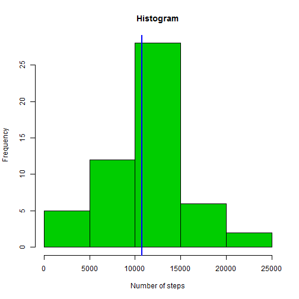
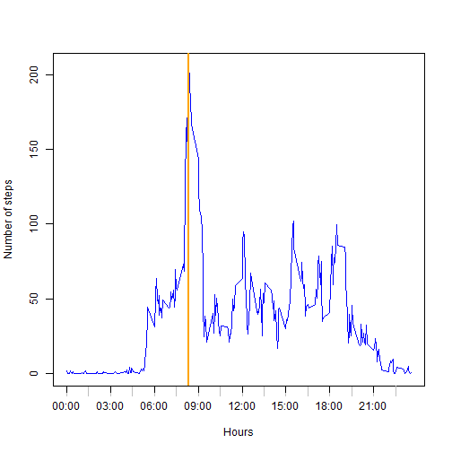
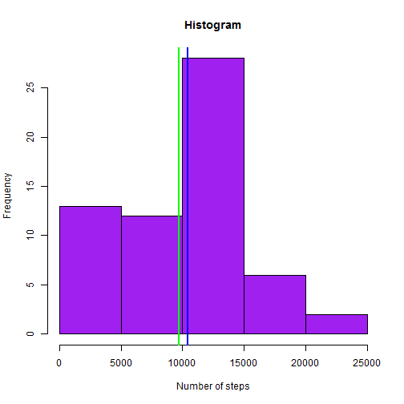

Activity Monitoring Device
==========================

### Carlos Pavón
### December 9, 2017

The improvement of health is a great concern, and the use of monitoring activity devices has become very popular these days. Regular physical activity is related to wellness and wellbeing, and the use monitoring devices can record electronically the numer of steps a person has taken in a period of time. Mining patterns in the data collected from monitoring activity device can help improve physical activity and overall health.

This document contains the processing of an example dataset from monitoring activity devices and it include plots for ilustrations when necessary. It starts in a logical order from loading the data into R, doing data management and other calculations, and making visualizations. The data is found online at  [data file](https://github.com/cfpavon/RepData_PeerAssessment1/blob/master/activity.zip).  

## Loading and processing the data

Here, we start the script and download the data to a folder:


```r
library(readr)
library(dplyr)
library(tidyr)
library(lubridate)
library(lattice)
setwd('C:/Users/Carlos P/Documents/Data Science Coursera/Reproducible Research/Project1/')
stepsDataAddress <- c('https://d396qusza40orc.cloudfront.net/repdata%2Fdata%2Factivity.zip')
fileName='steps_data.zip'
#download.file(stepsDataAddress, 'steps_data.zip')
```

The dataset contained some missing values for the number of steps, so two different R dataframes created use one with missing values and  the other without missing values. At the same time of loading from new variables are created and format are given to the time columns. Here is the code:


```r
#Load the data
stepsData<-read_csv(fileName,na="NA",col_types = list(steps=col_integer(),             date=col_character(),interval=col_integer()))%>%
  mutate(date=as.Date(date), weekday=factor(weekdays(as.Date(date))))
#Missing Values Dataset
stepsDataMissing=stepsData%>%
  filter(is.na(steps))%>% select(-steps)
#Complete Cases Dataset
stepsData<-na.omit(stepsData)
```

## What is mean total number of steps taken per day?

A histogram of the number of steps in the dataset is presented. The data shows that the mean total number of steps taken each day was 10766.19. In the histogram, there is a vertical line to show both mean and median. The average number of steps taken each day was between 41 and 21194. 


```r
#Calculates total number of steps per day
sumStepsDay=stepsData%>%group_by(date)%>%summarise(steps=sum(steps))%>%ungroup()
#Histogram
with(sumStepsDay,{hist(steps,col=259,main="Histogram",xlab="Number of steps")
  abline(v=mean(steps),col="magenta",lwd=2)
  abline(v=median(steps),col="blue",lwd=2)})
```



The distribution of this variable is symmetric and both mean and median are very close to each other. Their values are:


```r
#Median
median(sumStepsDay$steps)
```

```
## [1] 10765
```

```r
#Mean
mean(sumStepsDay$steps)
```

```
## [1] 10766.19
```

## What is average daily pattern?

The time series plot for the average daily pattern shows that the number of steps start to pick up at around before 6:00am. Furthermore, the highest 5-minute interbval was 8:35am with around 206.2 steps.


```r
#Calculate Daily Pattern
averageDailyPattern=stepsData%>%group_by(interval)%>%summarise(steps=mean(steps))%>%
  ungroup()
#Get the interval for maximum steps
maximumSteps=averageDailyPattern%>%  filter(steps==max(steps))
maximumSteps
```

```
## # A tibble: 1 x 2
##   interval    steps
##      <int>    <dbl>
## 1      835 206.1698
```

The number of steps reach the the highest number of steps are at around 8:35am. Then after 9:00am they come down somewhat but there are other smaller peaks during the rest of the day. At the end of the day the physical activity is almost none after 8:00 pm. 


```r
#Set up the ticks and labels
xTick=seq(0, 2359, by = 300)
xLabels=format(strptime(sprintf("%04d", xTick), format = "%H%M"),format="%H:%M")
#Make the plot
with(averageDailyPattern,{plot(interval,steps,type="l",xlab="Hours",ylab="Number of steps",col="blue",xaxt="n")
  abline(v=maximumSteps$interval,col="orange",lwd=2)
  rug(x = seq(0, 2359, by = 150), ticksize = -0.03, side = 1,col="gray")
  axis(1,at=xTick,labels=xLabels, las=1)})
```



## Imputing missing values


```r
numberMissing=nrow(stepsDataMissing)
numberMissing
```

```
## [1] 2304
```

There were 2304 missing values for the number of steps. The strategy used to fill the missing observartions was to calculate the per weekday for each time interval. This strategy was based on the idea that different day of the week could generate certain pattern on the number of steps. As a result, this calculation gave 252 median values for each day of the week.   


```r
averageStepsWeekday=stepsData%>%group_by(interval,weekday)%>%  summarise(steps=round(median(steps),0))%>%ungroup()
stepsDataFilled=left_join(stepsDataMissing,averageStepsWeekday,
                          by=c("interval","weekday"))
stepsDataComplete=bind_rows(stepsData,stepsDataFilled)%>%  mutate(typeDay=factor(if_else(weekday %in% c("Saturday","Sunday"),"Weekend","Weekday")))
```

The result from the imputation strategy were joined with the missing observations, and all combined into a complete cases dataset which was use for the next steps.


```r
sumStepsDayC=stepsDataComplete%>%group_by(date)%>%summarise(steps=sum(steps))%>%
  ungroup()
stepsMedian=median(sumStepsDayC$steps)
StepsMean=mean(sumStepsDayC$steps)
with(sumStepsDayC,{hist(steps,col="purple",main="Histogram",xlab="Number of steps")
  abline(v=mean(steps),col="green",lwd=2)
  abline(v=median(steps),col="blue",lwd=2)})
```



This histogram with the filled values is similar to the one of the complete cases. Both median and mean for the filled data were smaller in value than the one of the complete cases. Their values are presented here: 

```r
stepsMedian
```

```
## [1] 10395
```

```r
StepsMean
```

```
## [1] 9705.311
```

## Are there differences in activity patterns between weekdays and weekends?


```r
averageTypeDay=group_by(stepsDataComplete,interval,typeDay)%>%
  summarise(steps=mean(steps))%>%ungroup()
xyplot(steps~interval|typeDay,averageTypeDay, main="",ylab="Number of steps",  
       xlab="Hours", type="l", xlim=c(0,2359), 
       scales=list(x=list(at=xTick, labels=xLabels)), layout=c(1,2))
```


There is a clear differences in the types of pattern from the weekdays and weekend. First, the weekdays' highest peak which higher that the one of the weekend which signals a more concentrated at physical activity maybe due to commuting to work. Second, the weekend present a more gradual curve of physical activity throughout the day. This could have being expected to due free time and ability to  schedule different plans. Third, the net number of steps during the weekend was higher than the weekday. This is also related to leisure activities and recreation. Finally, this dataset provided great insight into the physical activity of subject being monitored, the data can be use to improve the wellness and well being of the persons involved. The monitoring devices are a great aid into the process of achieving a healthier lifestyle.
```
```
```
```
```
```
```
```

